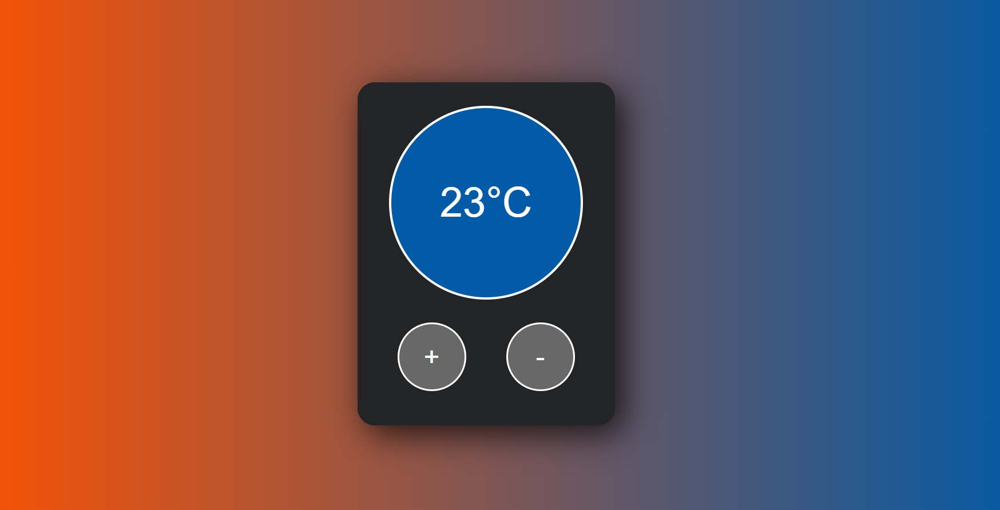

# Temperature controler

This basic react app showcases changing temperature by pressing a button, which changes display in the form of color and number.
## Try It
This project is currently hosted on netlify.app, [give it a try :)]()

## What did i learn

- How to set up a React project
- Using state to display values
- Changing CSS depending on state
- Updating state using onClick eventsingularize('phenomena')
